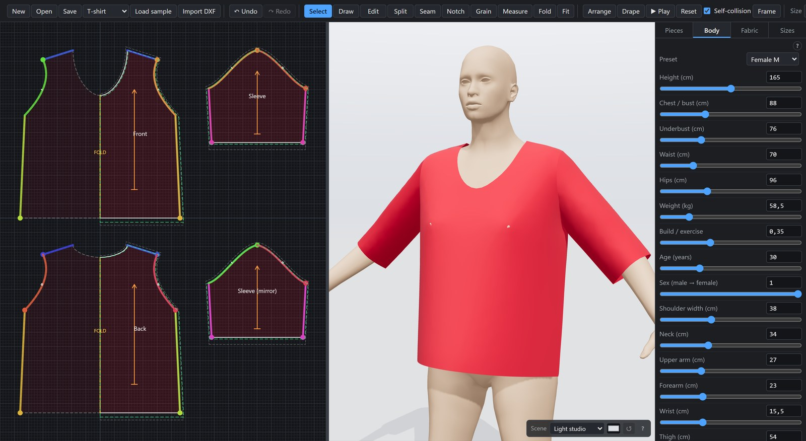
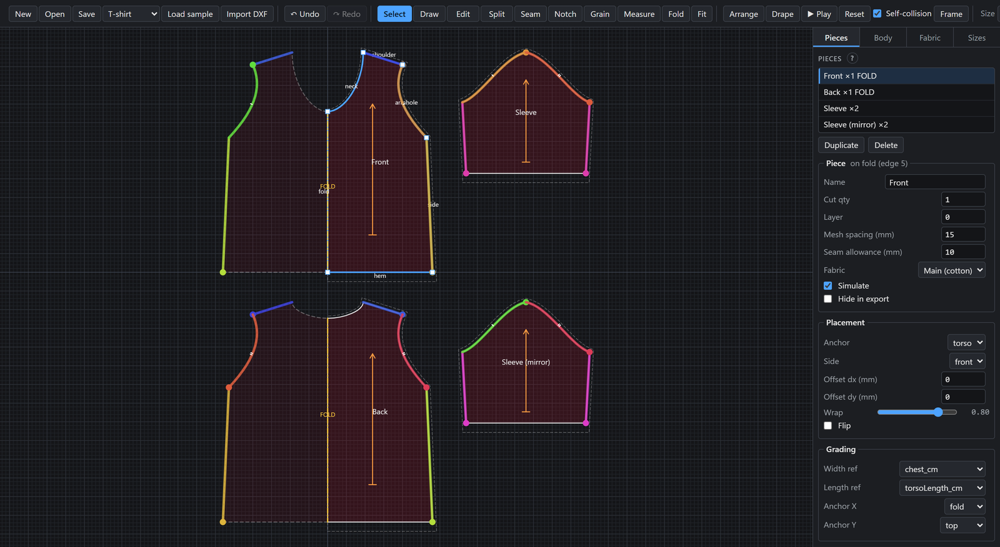
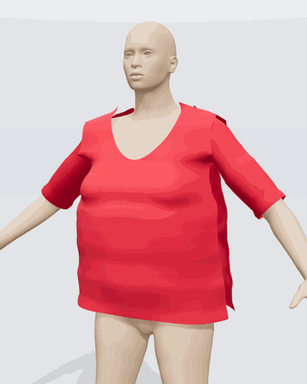
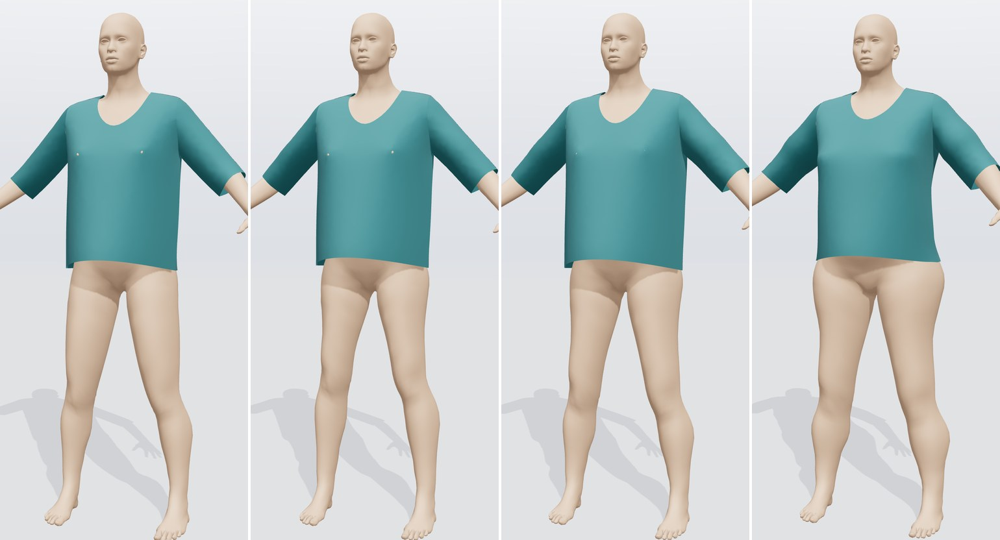
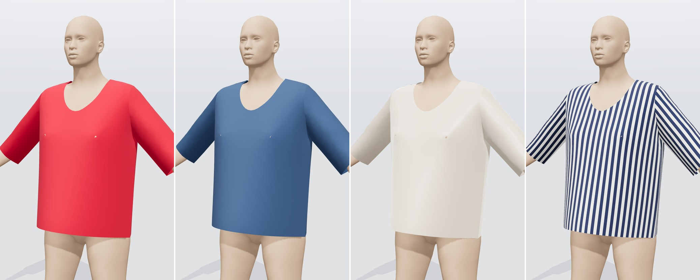
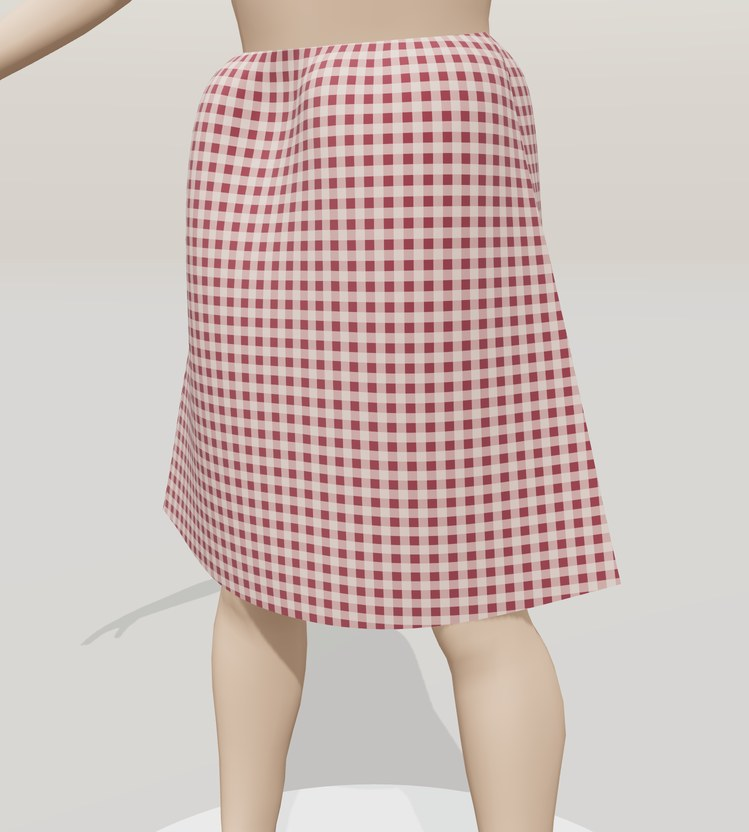
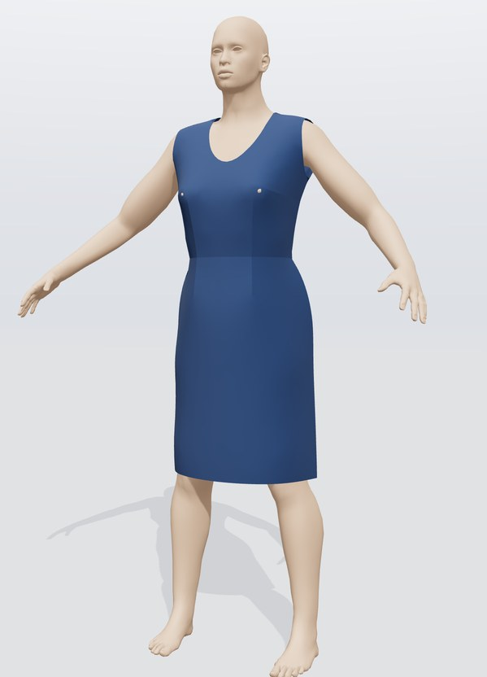
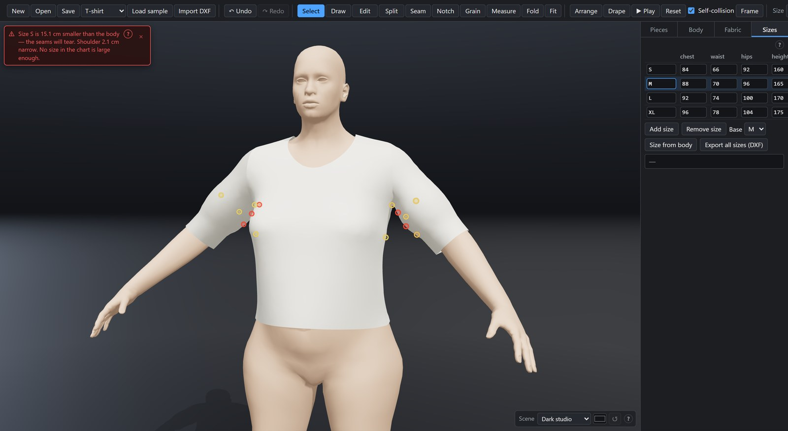
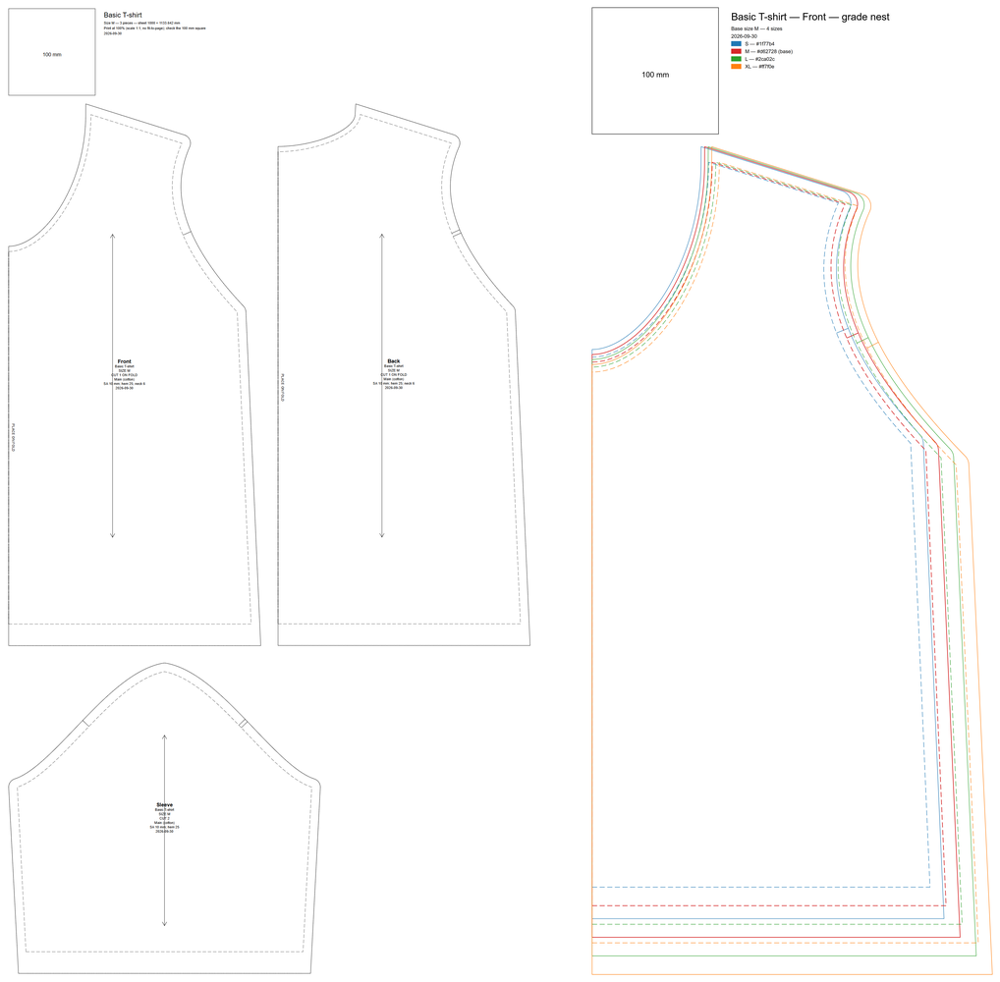

# Clothing CAD

[](https://github.com/Bruno-PRDA/Clothing-CAD/actions/workflows/tests.yml)

**Design clothes in 2D, sew them, and drape them on a 3D body, in the browser, with nothing to install.**
An open-source garment CAD in the spirit of CLO 3D and Marvelous Designer: draw the pattern, fit it to real
measurements with a real cloth simulation (XPBD), grade it across sizes, and send it to print or to other pattern
CAD (Gerber, Lectra, Optitex, CLO…) as DXF-AAMA.

### ▶ [Try it online: bruno-prda.github.io/Clothing-CAD](https://bruno-prda.github.io/Clothing-CAD/)



Nothing is uploaded: the app runs entirely in your browser and your projects stay on your computer. The first
visit downloads about 20 MB (mostly the body model); after that the browser caches it.

**New here? Click `? Guide` at the right end of the toolbar, or press `?`.** The built-in guide walks through
the whole app: a five-minute tour, every tool and panel, sizes and fit warnings, exporting, shortcuts and
troubleshooting.

## What it does today

### Draw the pattern



Lines and bezier curves, point editing, split edges, seams (click edge A, then edge B), notches, grainlines,
fold edges, darts and a seam allowance per edge. Seam lengths are compared as you work, and each piece carries its
own placement, fabric and grading rules.

### Sew it and drape it



The pieces are arranged around the body, sewn together, and dropped under gravity by an **XPBD cloth solver**
written for this app: stretch and bending, seam sewing, collision with the body and friction, and
self-collision, stepped at a fixed rate so every drape is reproducible.

Orbit, zoom and frame the 3D view, choose a backdrop (workshop, studios, pedestal, runway, wood, terrace), or
pop the 3D view out into its own window.

<br clear="right">

### On any body, in every size



The body is MakeHuman's CC0 template mesh, reshaped until it measures what you type: **24 measurements and
traits** (height, chest, waist, hips… weight, build, age, sex) and 9 presets, or type your height and weight and
let it estimate the rest. The size chart grades the pattern, and the 3D view drapes the size you pick.

### Pick the fabric





Seven fabric presets (cotton, denim, silk, jersey, wool, leather, chiffon), each with its own physics and
look, any colour, and six procedural textures (solid, stripes, gingham, dots, twill, knit). Two sliders scale
stretch and bending stiffness for the whole simulation.

Three garments are built in: a T-shirt, an A-line skirt and a fitted dress.

<br clear="right">

### Shape it with darts



A dart folds a wedge out of a flat piece so it can follow the bust or the waist. Press `T`, click an edge and a
dart opens there; drag its point, the corners of its mouth or its middle to reshape it, and the piece is meshed
with the dart cut in and sewn shut in 3D. Seams compare **sewn lengths** (an edge's length less the width of its
darts), so a bodice and a skirt still close at the waist when their darts do not line up. The SVG and print
sheets draw each dart's legs and drill hole, and DXF-AAMA carries darts both ways. The **fitted dress** sample
is built on them: a sleeveless bodice with bust and waist darts, a waist seam, a skirt, and a centre-back zip.

<br clear="right">

### Know when it won't fit



Before a frame is simulated, the pattern is checked against the body. A size that is too small gets a banner,
with a one-click switch to a size that fits when the chart has one, and rings in 3D mark where the cloth
over-stretches or a seam cannot close.

### Take it to the cutting table



On the right, the front piece graded from S to XL: the nest the DXF export writes for other pattern CAD.

* **SVG** pattern sheet at 1:1 scale in millimetres, per size, with cut line, stitch line, notches, grainline,
  fold labels and a 100 mm calibration square.
* **Print** tiled pages (A4 / Letter / A3) for printing at 100 %, then taping together.
* **CSV / JSON** size chart and piece measurements.
* **JSON** project save / load (and autosave in the browser); **OBJ** of the draped garment.
* **DXF-AAMA** (ASTM D6673) for other pattern CAD and cutters: one size or every size as a graded nest, with cut
  and sew lines, corner and curve points, notches, grainline and piece text. **Import DXF** reads files from
  Gerber, Lectra, CLO, Optitex, Valentina and Seamly2D, rebuilding editable curves and seam allowances.

## Where it's heading

The aim is a garment CAD a **fashion designer** can use for real work: any garment, on a body they trust. The
full plan, with what works and what does not yet, is in **[docs/ROADMAP.md](docs/ROADMAP.md)**.

| | Next | What it unlocks |
|---|---|---|
| 1 ✓ | **Darts and a fitted dress** *(done)* | Darts that shape the cloth, a dart tool, seams that compare sewn lengths; a sleeveless dress with a waist seam |
| 2 | **Speed** | The cloth solver in a Web Worker; bigger garments stay smooth |
| 3 | **Shirts** | Set-in sleeves, collar and stand, cuffs, plackets; gathers, pleats and elastic |
| 4 | **Outfits on a posed body** | Several garments layered; posing the body; later, a walk |
| 5 | **Trousers** | Crotch and inseam, legs apart, cloth between the legs |
| 6 | **A drape you can trust** | Calibrated woven stretch, grain direction, finer collision, pinning in 3D |
| 7 | **Sheath dress** | Darts pointed at both ends, inside the piece |

## Run

No installation, no build step, no Node.js. Everything is plain JavaScript ES modules; three.js is loaded from a
CDN import map (run `python vendor.py` once if you want it to work offline).

```bash
python serve.py
```

This starts a local server on http://localhost:8710/ and opens it in your default browser
(Chrome, Edge or Firefox). Double-clicking `run.bat` does the same on Windows.

Your work is autosaved in the browser as you go, and offered back after a crash or a closed tab.
That copy lives only in that browser, so use **Save** to keep a project as a file.

## Windows

| Pane | What it does |
|---|---|
| Left: **2D pattern editor** | Draw pieces (lines and bezier curves), edit points, split edges, define seams (click edge A then edge B), notches, darts, grainlines, fold edges, seam allowance. |
| Right: **3D physics view** | The garment is arranged around the body, sewn (seams pull together) and draped with an XPBD cloth solver. Orbit with the mouse. `Pop out` opens the 3D view in its own window. |
| Dock: **Pieces / Body / Fabric / Sizes** | Piece properties and placement; body presets and 24 sliders (measurements plus height, weight, build, age and sex); fabric presets, colour and texture; size chart and grading. |

The body is MakeHuman's CC0 template mesh (`assets/body/`, see its `LICENSE.md`), reshaped by morph targets until its
measurements match the Body tab. If those files cannot be loaded, a simpler analytic mannequin is used instead.
A banner warns when the active size is too small for the body, and markers show where the cloth over-stretches.

Keyboard: `V` select, `P` draw, `E` edit, `S` seam, `N` notch, `T` dart, `G` grainline, `M` measure,
`Space` play/pause, `D` drape, `R` reset, `Ctrl+Z`/`Ctrl+Y` undo/redo, `Delete`, `Esc`, `?` guide.
The guide's *Keyboard shortcuts* page lists every binding.

## Project layout

```
index.html, popout.html    app shell and pop-out window
serve.py, run.bat          dev server (Python standard library only)
vendor.py                  optional: vendor three.js locally for offline use
styles/                    CSS
src/core/                  shared contracts: types, events, store, schema, units, fabrics, sdf
src/samples/               built-in garments (T-shirt, A-line skirt, fitted dress)
src/geometry/              2D maths: beziers, polygons, Delaunay remesh, offset, packing
src/pattern/               2D pattern editor
src/body/                  body: MakeHuman template, measurements, fit to the sliders, SDF bake (+ analytic fallback)
assets/body/               the template mesh and morph targets (CC0), built by tools/build_body_assets.py
src/cloth/                 XPBD cloth solver, collision, seams, fixtures
src/viewer3d/              three.js scene, cloth/body meshes, materials, textures
src/sizing/, src/export/   size charts, grading, SVG / print / CSV / OBJ export
src/dxf/                   DXF-AAMA / ASTM D6673 import and export (reader, writer, curve fitting)
src/ui/                    toolbar, dock panels, status bar, shortcuts, fit banner, user guide (guideContent.js)
src/app/                   boot, wiring, window.__app automation API
tests/acceptance.js        in-page acceptance suite: __app.acceptance.run()
tools/screenshots.py       regenerates the pictures in this README (docs/images/)
docs/SPEC.md               the full specification (single source of truth)
docs/CONTRACTS.md          per-module API cheat sheet
docs/ROADMAP.md            where the project is going
```

## Automation / debugging

Open the browser console and use `window.__app` (see `docs/SPEC.md` section 12), e.g.

```js
__app.loadSample('tshirt'); __app.sim.step(300)      // simulate 5 s synchronously, returns stats
__app.body.setParam('chest_cm', 100)                  // rebuild the body
__app.export.sheetSvg('L')                            // SVG string for size L
__app.dxf.export('*')                                 // DXF-AAMA text of every size (a graded nest)
__app.viewer.scene('pedestal')                        // backdrop and floor of the 3D view
__app.autosave.status()                               // autosave state (storage, unsaved changes, last write)
__app.acceptance.run()                                // run the acceptance suite
```

URL options: `?sample=skirt`, `?size=L`, `?nosim=1`, `?autosave=0` (no autosave and no recovery offer),
`?bodyassets=<url>` (load the body model from elsewhere), `?acceptance=1` (run the suite after start-up).

## Tests

Every push and pull request runs all module self-tests and the acceptance suite in headless Chromium on GitHub
Actions ([`.github/workflows/tests.yml`](.github/workflows/tests.yml)); the results are in the **Actions** tab. To
run the same thing locally:

```bash
python -m pip install playwright
python -m playwright install chromium
python tests/ci/run_browser_tests.py --serve
```

Or open the app and run `__app.selftest.run()` / `__app.acceptance.run()` in the console. Check 10 is red on
purpose (see `docs/SPEC.md` section 13); speed assertions only warn on the CI runners, which have no GPU.

The README pictures come from the same automation API: `python -m pip install pillow`, then
`python tools/screenshots.py` (or name the shots to retake, e.g. `hero bodies`; `--list` shows them).

## Licence

Clothing CAD is free software: you can redistribute it and/or modify it under the terms of the
**GNU General Public License, version 3 or (at your option) any later version** — the same licence as
Blender. See [`LICENSE`](LICENSE) for the full text. It comes with no warranty.

Copyright (C) 2026 the Clothing CAD contributors.

By contributing to this repository you agree that your contribution is licensed under the same terms.

Third-party parts keep their own licences:

| Part | Licence | Where |
|---|---|---|
| Body mesh and morph targets, from MakeHuman | CC0 1.0 (public domain) | `assets/body/`, see [`assets/body/LICENSE.md`](assets/body/LICENSE.md) |
| three.js and its `RoomEnvironment` / `OrbitControls` add-ons | MIT | loaded from jsDelivr, or `vendor/` after `python vendor.py` |

MakeHuman's *program code* is AGPL and is not used; only its CC0 assets are.
